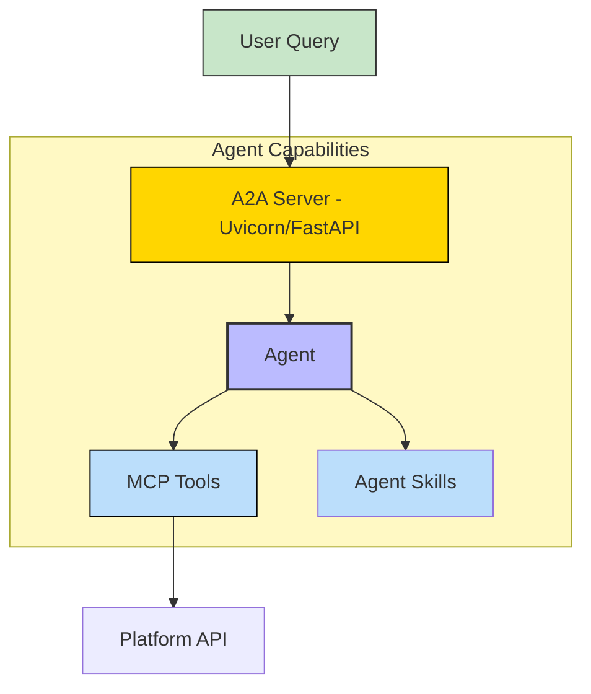
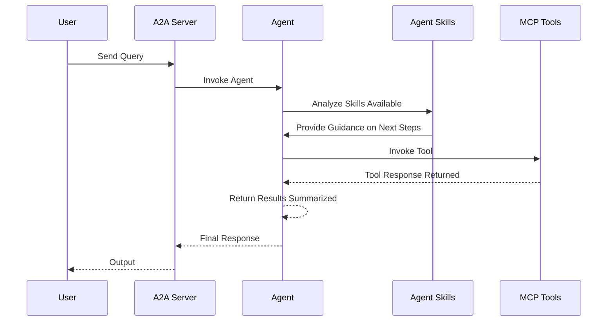

# AdGuard Home Agent - A2A | AG-UI | MCP | API


*Version: 0.2.21*

## Overview

The **AdGuard Home MCP Server** provides a Model Context Protocol (MCP) interface to interact with the AdGuard Home API, enabling automation and management of AdGuard Home resources such as devices, DNS servers, filter lists, query logs, and statistics. This server is designed to integrate seamlessly with AI-driven workflows and can be deployed as a standalone service or used programmatically.

### Features

- **Comprehensive API Coverage**: Manage AdGuard Home resources including devices, DNS servers, filter lists, query logs, and statistics.
- **MCP Integration**: Exposes AdGuard Home API functionalities as MCP tools for use with AI agents or direct API calls.
- **Authentication**: Supports Basic Authentication.
- **Environment Variable Support**: Securely configure credentials and settings via environment variables.
- **Docker Support**: Easily deployable as a Docker container for scalable environments.
- **Extensive Documentation**: Clear examples and instructions for setup, usage, and testing.

## MCP

### MCP Tools

The `adguard-home-agent` package exposes the following MCP tools, organized by category:

### Account & Profile
- `get_account_limits()`: Get account limits.
- `get_profile()`: Get current user profile info.
- `update_profile(profile_data)`: Update current user profile info.

### Blocked Services
- `get_all_blocked_services()`: Get available services to block.
- `get_blocked_services_list()`: Get blocked services list.
- `update_blocked_services(services)`: Update blocked services list.

### Clients
- `list_clients()`: List all clients.
- `search_clients(query)`: Search for clients.
- `add_client(name, ids, ...)`: Add a new client.
- `update_client(name, data)`: Update a client.
- `delete_client(name)`: Delete a client.

### DHCP
- `get_dhcp_status()`: Get DHCP status.
- `get_dhcp_interfaces()`: Get available interfaces.
- `set_dhcp_config(config)`: Set DHCP configuration.
- `find_active_dhcp(interface)`: Find active DHCP server.
- `add_dhcp_static_lease(mac, ip, hostname)`: Add static lease.
- `remove_dhcp_static_lease(mac, ip, hostname)`: Remove static lease.
- `update_dhcp_static_lease(mac, ip, hostname)`: Update static lease.
- `reset_dhcp()`: Reset DHCP config.
- `reset_dhcp_leases()`: Reset DHCP leases.

### DNS
- `get_dns_info()`: Get DNS parameters.
- `set_dns_config(config)`: Set DNS parameters.
- `test_upstream_dns(upstreams)`: Test upstream configuration.
- `set_protection(enabled, duration)`: Set protection state.
- `clear_cache()`: Clear DNS cache.

### Filtering
- `get_filtering_status()`: Get filtering status.
- `set_filtering_config(enabled, interval)`: Set filtering config.
- `set_filtering_rules(rules)`: Set user-defined rules.
- `check_host_filtering(name)`: Check if host is filtered.
- `add_filter_url(name, url, whitelist)`: Add filter URL.
- `remove_filter_url(url, whitelist)`: Remove filter URL.
- `set_filter_url_params(url, name, whitelist)`: Set filter URL parameters.
- `refresh_filters(whitelist)`: Refresh filters.

### Mobile Config
- `get_doh_mobile_config(host, client_id)`: Get DNS over HTTPS .mobileconfig.
- `get_dot_mobile_config(host, client_id)`: Get DNS over TLS .mobileconfig.

### Query Log
- `get_query_log(limit, ...)`: Get query log.
- `get_query_log_config()`: Get query log config.
- `set_query_log_config(enabled, ...)`: Set query log config.
- `clear_query_log()`: Clear query log.

### Rewrites
- `list_rewrites()`: List DNS rewrites.
- `add_rewrite(domain, answer)`: Add DNS rewrite.
- `update_rewrite(target, update)`: Update DNS rewrite.
- `delete_rewrite(domain, answer)`: Delete DNS rewrite.
- `get_rewrite_settings()`: Get rewrite settings.
- `update_rewrite_settings(enabled)`: Update rewrite settings.

### Settings
- `get_safebrowsing_status()`: Get SafeBrowsing status.
- `enable_safebrowsing()`: Enable SafeBrowsing.
- `disable_safebrowsing()`: Disable SafeBrowsing.
- `get_safesearch_status()`: Get SafeSearch status.
- `update_safesearch_settings(enabled, ...)`: Update SafeSearch settings.
- `get_parental_status()`: Get parental control status.
- `enable_parental_control()`: Enable parental control.
- `disable_parental_control()`: Disable parental control.

### Statistics
- `get_stats()`: Get overall statistics.
- `get_stats_config()`: Get stats config.
- `set_stats_config(interval)`: Set stats config.
- `reset_stats()`: Reset all statistics.

### System
- `get_version()`: Get AdGuard Home version/status.

### TLS
- `get_tls_status()`: Get TLS status.
- `configure_tls(config)`: Configure TLS.
- `validate_tls(config)`: Validate TLS config.

## A2A Agent

### Architecture:



### Component Interaction Diagram



## Usage

### MCP CLI

| Short Flag | Long Flag                          | Description                                                                 |
|------------|------------------------------------|-----------------------------------------------------------------------------|
| -h         | --help                             | Display help information                                                    |
|            | --auth-type                        | Authentication type (default: none)                                         |

### A2A CLI
#### Endpoints
- **Web UI**: `http://localhost:8000/` (if enabled)
- **A2A**: `http://localhost:8000/a2a` (Discovery: `/a2a/.well-known/agent.json`)
- **AG-UI**: `http://localhost:8000/ag-ui` (POST)

| Long Flag        | Description                                      | Default                     |
|------------------|--------------------------------------------------|-----------------------------|
| --host           | Host to bind the server to                       | 0.0.0.0                     |
| --port           | Port to bind the server to                       | 9000                        |
| --reload         | Enable auto-reload                               | False                       |
| --provider       | LLM Provider (openai, anthropic, google, etc)    | openai                      |
| --model-id       | LLM Model ID                                     | qwen/qwen3-coder-next               |
| --base-url       | LLM Base URL (for OpenAI compatible providers)   | http://host.docker.internal:1234/v1    |
| --api-key        | LLM API Key                                      | ollama                      |
| --mcp-url        | MCP Server URL to connect to                     | None                        |
| --mcp-config     | MCP Server Config                                | .../mcp_config.json         |
| --skills-directory| Directory containing agent skills               | ...                         |
| --web            | Enable Pydantic AI Web UI                        | False (Env: ENABLE_WEB_UI)  |

### Using as an MCP Server

The MCP Server can be run in two modes: `stdio` (for local testing) or `http` (for networked access). To start the server, use the following commands:

#### Run in stdio mode (default):
```bash
adguard-home-mcp
```

#### Run in HTTP mode:
```bash
adguard-home-mcp --transport http --host 0.0.0.0 --port 8012
```

Set environment variables for authentication:
```bash
export ADGUARD_URL="http://adguard-home:3000"
export ADGUARD_USERNAME="your-username"
export ADGUARD_PASSWORD="your-password"
```

### Use API Directly

You can interact with the AdGuard Home API directly using the `Api` class from `adguard_api.py`. Below is an example of creating a device:

```python
from adguard_home_agent.adguard_api import Api

# Initialize the API client
client = Api(
    base_url="http://adguard-home:3000",
    username="your-username",
    password="your-password"
)

# Create a device
device = client.create_device(
    name="Test Device",
    device_type="mobile",
    dns_server_id="123"
)
print(device)
```

### Deploy MCP Server as a Service

The AdGuard Home MCP server can be deployed using Docker.

#### Using Docker Run

```bash
docker pull knucklessg1/adguard-home-agent:latest

docker run -d \
  --name adguard-home-mcp \
  -p 8012:8012 \
  -e HOST=0.0.0.0 \
  -e PORT=8012 \
  -e TRANSPORT=http \
  -e ADGUARD_URL=http://adguard-home:3000 \
  -e ADGUARD_USERNAME=your-username \
  -e ADGUARD_PASSWORD=your-password \
  knucklessg1/adguard-home-agent:latest
```

#### Using Docker Compose

Create a `compose.yml` file:

```yaml
services:
  adguard-home-mcp:
    image: knucklessg1/adguard-home-agent:latest
    environment:
      - HOST=0.0.0.0
      - PORT=8012
      - TRANSPORT=http
      - ADGUARD_URL=${ADGUARD_URL}
      - ADGUARD_USERNAME=${ADGUARD_USERNAME}
      - ADGUARD_PASSWORD=${ADGUARD_PASSWORD}
    ports:
      - "8012:8012"
```

Run the service:

```bash
docker-compose up -d
```

## Install Python Package

Install the `adguard-home-agent` package using pip:

```bash
python -m pip install adguard-home-agent[all]
```

### Dependencies

Ensure the following Python packages are installed:
- `requests`
- `fastmcp`
- `pydantic`

Install dependencies manually if needed:
```bash
python -m pip install requests fastmcp pydantic
```

## Tests

### Pre-commit Checks

Run pre-commit checks to ensure code quality and formatting:
```bash
pre-commit run --all-files
```

To set up pre-commit hooks:
```bash
pre-commit install
```

### Validate MCP Server

Validate the MCP server configuration and tools using the MCP inspector:
```bash
npx @modelcontextprotocol/inspector adguard-home-mcp
```

## Repository Owners


## Contributing

Contributions are welcome! Please follow these steps:
1. Fork the repository.
2. Create a new branch (`git checkout -b feature/your-feature`).
3. Make your changes and commit (`git commit -m 'Add your feature'`).
4. Push to the branch (`git push origin feature/your-feature`).
5. Open a pull request.

Please ensure your code passes pre-commit checks and includes relevant tests.

## License

This project is licensed under the MIT License. See the [LICENSE](LICENSE) file for details.

## Support

For issues or feature requests, please open an issue on the [GitHub repository](https://github.com/Knuckles-Team/adguard-home-agent). For general inquiries, contact the maintainers via GitHub.
