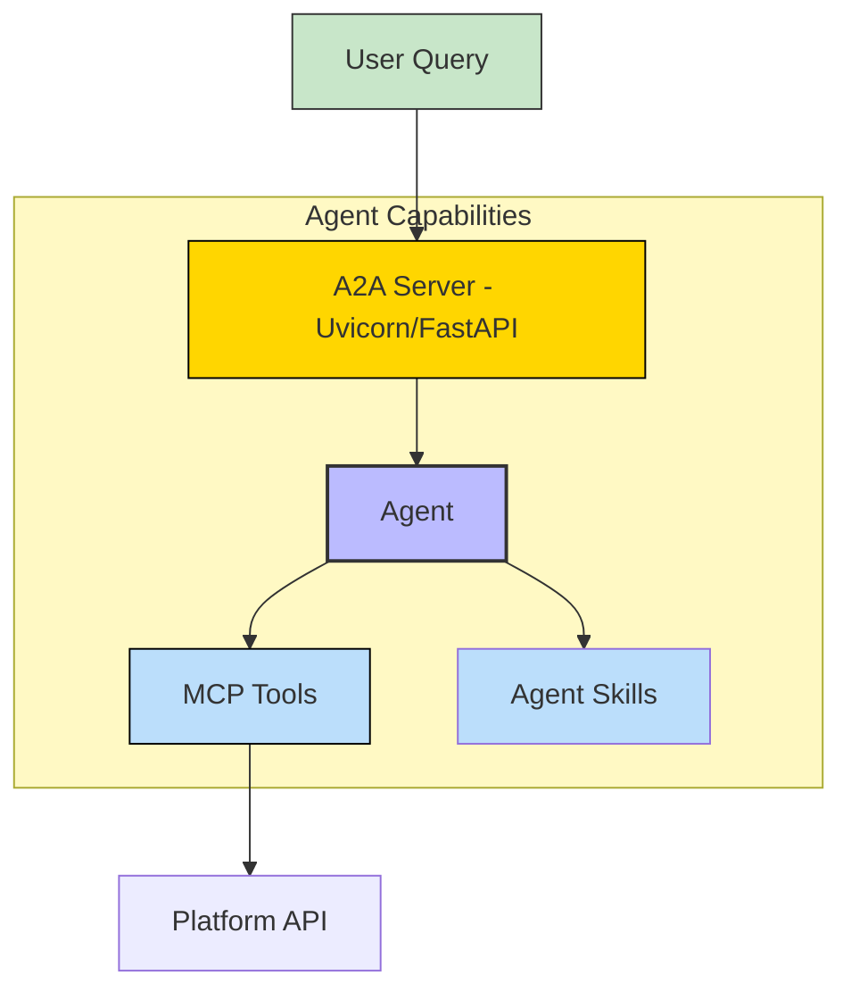
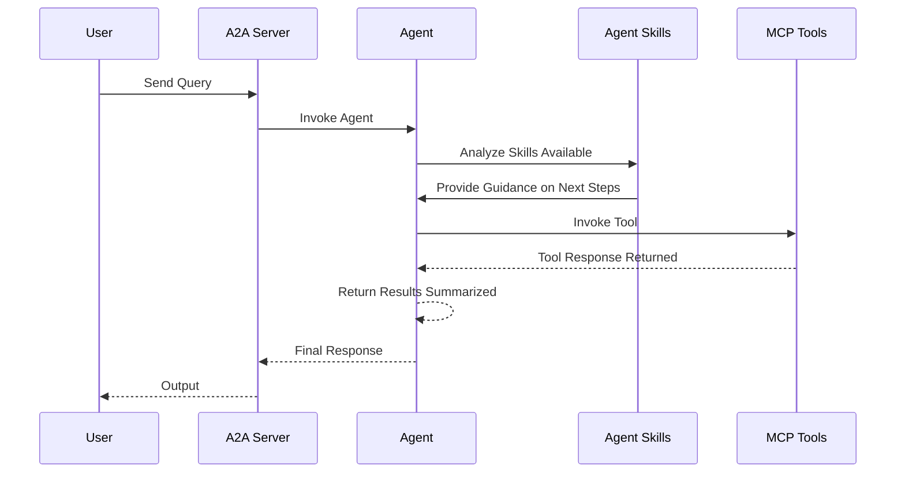
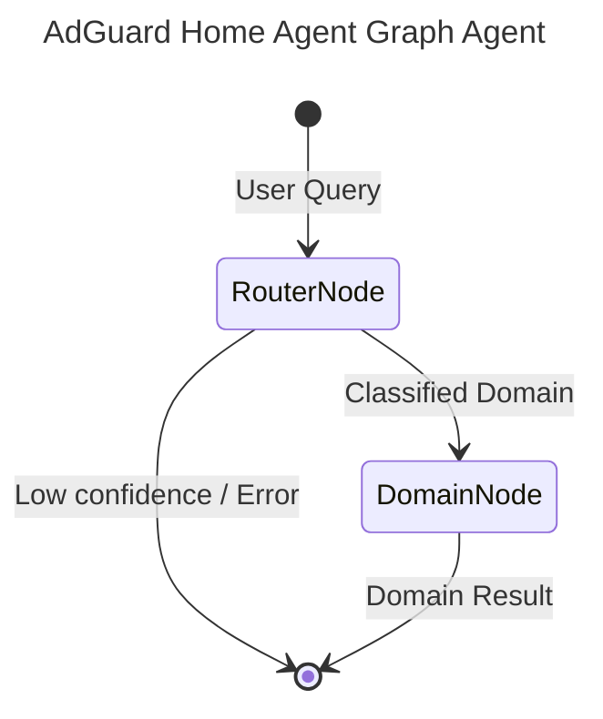

# AdGuard Home Agent - A2A | AG-UI | MCP | API


*Version: 0.12.1*

## Overview

The **AdGuard Home MCP Server** provides a Model Context Protocol (MCP) interface to interact with the AdGuard Home API, enabling automation and management of AdGuard Home resources such as devices, DNS servers, filter lists, query logs, and statistics. This server is designed to integrate seamlessly with AI-driven workflows and can be deployed as a standalone service or used programmatically.

### Features

- **Comprehensive API Coverage**: Manage AdGuard Home resources including devices, DNS servers, filter lists, query logs, and statistics.
- **MCP Integration**: Exposes AdGuard Home API functionalities as MCP tools for use with AI agents or direct API calls.
- **Authentication**: Supports Basic Authentication.
- **Environment Variable Support**: Securely configure credentials and settings via environment variables.
- **Docker Support**: Easily deployable as a Docker container for scalable environments.
- **Extensive Documentation**: Clear examples and instructions for setup, usage, and testing.

## MCP

### Available MCP Tools

This server utilizes dynamic Action-Routed tools to optimize token overhead and maximize IDE compatibility.

| Tool Name | Description |
|-----------|-------------|
| `adguard_access` | Consolidated Action-Routed tool for access. Methods: get_access_list, set_access_list |
| `adguard_blocked_services` | Consolidated Action-Routed tool for blocked-services. Methods: get_blocked_services_list, get_all_blocked_services, update_blocked_services |
| `adguard_clients` | Consolidated Action-Routed tool for clients. Methods: list_clients, search_clients, add_client, update_client, delete_client |
| `adguard_dhcp` | Consolidated Action-Routed tool for dhcp. Methods: get_dhcp_status, get_dhcp_interfaces, set_dhcp_config, find_active_dhcp, add_dhcp_static_lease, remove_dhcp_static_lease, update_dhcp_static_lease, reset_dhcp, reset_dhcp_leases |
| `adguard_dns` | Consolidated Action-Routed tool for dns. Methods: get_dns_info, set_dns_config, test_upstream_dns |
| `adguard_filtering` | Consolidated Action-Routed tool for filtering. Methods: set_filtering_rules, check_host_filtering, set_filter_url_params, get_filtering_status, set_filtering_config, add_filter_url, remove_filter_url, refresh_filters |
| `adguard_mobile` | Consolidated Action-Routed tool for mobile. Methods: get_doh_mobile_config, get_dot_mobile_config |
| `adguard_profile` | Consolidated Action-Routed tool for profile. Methods: get_profile, update_profile |
| `adguard_query_log` | Consolidated Action-Routed tool for query-log. Methods: get_query_log, clear_query_log |
| `adguard_rewrites` | Consolidated Action-Routed tool for rewrites. Methods: list_rewrites, add_rewrite, delete_rewrite, update_rewrite, get_rewrite_settings, update_rewrite_settings |
| `adguard_settings` | Consolidated Action-Routed tool for settings. Methods: get_parental_status, enable_parental_control, disable_parental_control, get_safebrowsing_status, enable_safebrowsing, disable_safebrowsing, get_safesearch_status |
| `adguard_stats` | Consolidated Action-Routed tool for stats. Methods: get_stats, reset_stats, get_stats_config, set_stats_config |
| `adguard_system` | Consolidated Action-Routed tool for system. Methods: get_version, set_protection, clear_cache |
| `adguard_tls` | Consolidated Action-Routed tool for tls. Methods: get_tls_status, configure_tls, validate_tls |

## A2A Agent

### Architecture:


```mermaid
---
config:
  layout: dagre
---
flowchart TB
 subgraph subGraph0["Agent Capabilities"]
        C["Agent"]
        B["A2A Server - Uvicorn/FastAPI"]
        D["MCP Tools"]
        F["Agent Skills"]
  end
    C --> D & F
    A["User Query"] --> B
    B --> C
    D --> E["Platform API"]

     C:::agent
     B:::server
     A:::server
    classDef server fill:#f9f,stroke:#333
    classDef agent fill:#bbf,stroke:#333,stroke-width:2px
    style B stroke:#000000,fill:#FFD600
    style D stroke:#000000,fill:#BBDEFB
    style F fill:#BBDEFB
    style A fill:#C8E6C9
    style subGraph0 fill:#FFF9C4
```

### Component Interaction Diagram


```mermaid
sequenceDiagram
    participant User
    participant Server as A2A Server
    participant Agent as Agent
    participant Skill as Agent Skills
    participant MCP as MCP Tools

    User->>Server: Send Query
    Server->>Agent: Invoke Agent
    Agent->>Skill: Analyze Skills Available
    Skill->>Agent: Provide Guidance on Next Steps
    Agent->>MCP: Invoke Tool
    MCP-->>Agent: Tool Response Returned
    Agent-->>Agent: Return Results Summarized
    Agent-->>Server: Final Response
    Server-->>User: Output
```


## Graph Architecture

This agent uses `pydantic-graph` orchestration for intelligent routing and optimal context management.


```mermaid
---
title: AdGuard Home Agent Graph Agent
---
stateDiagram-v2
  [*] --> RouterNode: User Query
  RouterNode --> DomainNode: Classified Domain
  RouterNode --> [*]: Low confidence / Error
  DomainNode --> [*]: Domain Result
```

- **RouterNode**: A fast, lightweight LLM (e.g., `nvidia/nemotron-3-super`) that classifies the user's query into one of the specialized domains.
- **DomainNode**: The executor node. For the selected domain, it dynamically sets environment variables to temporarily enable ONLY the tools relevant to that domain, creating a highly focused sub-agent (e.g., `gpt-4o`) to complete the request. This preserves LLM context and prevents tool hallucination.

## Usage

### MCP CLI

| Short Flag | Long Flag                          | Description                                                                 |
|------------|------------------------------------|-----------------------------------------------------------------------------|
| -h         | --help                             | Display help information                                                    |
|            | --auth-type                        | Authentication type (default: none)                                         |

### A2A CLI
#### Endpoints
- **Web UI**: `http://localhost:8000/` (if enabled)
- **A2A**: `http://localhost:8000/a2a` (Discovery: `/a2a/.well-known/agent.json`)
- **AG-UI**: `http://localhost:8000/ag-ui` (POST)

| Long Flag        | Description                                      | Default                     |
|------------------|--------------------------------------------------|-----------------------------|
| --host           | Host to bind the server to                       | 0.0.0.0                     |
| --port           | Port to bind the server to                       | 9000                        |
| --reload         | Enable auto-reload                               | False                       |
| --provider       | LLM Provider (openai, anthropic, google, etc)    | openai                      |
| --model-id       | LLM Model ID                                     | nvidia/nemotron-3-super               |
| --base-url       | LLM Base URL (for OpenAI compatible providers)   | http://host.docker.internal:1234/v1    |
| --api-key        | LLM API Key                                      | ollama                      |
| --mcp-url        | MCP Server URL to connect to                     | None                        |
| --mcp-config     | MCP Server Config                                | .../mcp_config.json         |
| --skills-directory| Directory containing agent skills               | ...                         |
| --web            | Enable Pydantic AI Web UI                        | False (Env: ENABLE_WEB_UI)  |

### Using as an MCP Server

The MCP Server can be run in two modes: `stdio` (for local testing) or `http` (for networked access). To start the server, use the following commands:

#### Run in stdio mode (default):
```bash
adguard-home-mcp
```

#### Run in HTTP mode:
```bash
adguard-home-mcp --transport http --host 0.0.0.0 --port 8012
```

Set environment variables for authentication:
```bash
export ADGUARD_URL="http://adguard-home:3000"
export ADGUARD_USERNAME="your-username"
export ADGUARD_PASSWORD="your-password"
```

### Use API Directly

You can interact with the AdGuard Home API directly using the `Api` class from `adguard_api.py`. Below is an example of creating a device:

```python
from adguard_home_agent.adguard_api import Api

# Initialize the API client
client = Api(
    base_url="http://adguard-home:3000",
    username="your-username",
    password="your-password"
)

# Create a device
device = client.create_device(
    name="Test Device",
    device_type="mobile",
    dns_server_id="123"
)
print(device)
```

### Deploy MCP Server as a Service

The AdGuard Home MCP server can be deployed using Docker.

#### Using Docker Run

```bash
docker pull knucklessg1/adguard-home-agent:latest

docker run -d \
  --name adguard-home-mcp \
  -p 8012:8012 \
  -e HOST=0.0.0.0 \
  -e PORT=8012 \
  -e TRANSPORT=http \
  -e ADGUARD_URL=http://adguard-home:3000 \
  -e ADGUARD_USERNAME=your-username \
  -e ADGUARD_PASSWORD=your-password \
  knucklessg1/adguard-home-agent:latest
```

#### Using Docker Compose

Create a `compose.yml` file:

```yaml
services:
  adguard-home-mcp:
    image: knucklessg1/adguard-home-agent:latest
    environment:
      - HOST=0.0.0.0
      - PORT=8012
      - TRANSPORT=http
      - ADGUARD_URL=${ADGUARD_URL}
      - ADGUARD_USERNAME=${ADGUARD_USERNAME}
      - ADGUARD_PASSWORD=${ADGUARD_PASSWORD}
    ports:
      - "8012:8012"
```

Run the service:

```bash
docker-compose up -d
```

## Security & Governance

This project is built on [`agent-utilities`](https://github.com/Knuckles-Team/agent-utilities), inheriting enterprise-grade security and governance features.

### Authentication & Authorization
| Feature | Description |
|---------|-------------|
| **OIDC Token Delegation** | RFC 8693 token exchange for user-context propagation from A2A → MCP |
| **Eunomia Policies** | Fine-grained, policy-driven tool authorization (`none`, `embedded`, `remote`) |
| **Scoped Credentials** | Tools execute with the caller's scoped identity where possible |
| **3LO / OAuth / API Token** | Multiple auth strategies with graceful fallback |

### Eunomia Policy Enforcement
Eunomia provides a policy enforcement point for all tool calls:
- **Embedded mode**: Load local `mcp_policies.json` for role-based access, sensitivity gating, and audit logging
- **Remote mode**: Forward authorization decisions to a central Eunomia policy server for multi-agent governance
- Enable via CLI: `--eunomia-type embedded --eunomia-policy-file mcp_policies.json`

### Runtime Protections
| Protection | Description |
|------------|-------------|
| **Tool Guard** | Sensitivity detection with human-in-the-loop approval gating |
| **Prompt Injection Defense** | Input scanning and repetition/loop guards |
| **Content Filtering** | Output schema enforcement and cost budget controls |
| **Stuck Loop Detection** | Automatic detection and recovery from agent loops |
| **Context Limit Warnings** | Proactive alerts before context window exhaustion |

### Graph Agent Architecture
The A2A agent uses `pydantic-graph` orchestration with:
- **RouterNode**: Lightweight classifier that routes queries to specialized domains
- **DomainNode**: Focused executor with only relevant tools loaded, preventing tool hallucination
- **Approval Gates**: Policy-driven approval workflows before sensitive operations
- **Usage Guards**: Budget and rate limiting enforcement

> **Production Recommendation**: Enable `--eunomia-type embedded` (or `remote`) + OIDC delegation + containerized deployment. See [`agent-utilities` documentation](https://github.com/Knuckles-Team/agent-utilities) for full policy configuration.

## Install Python Package

Install the `adguard-home-agent` package using pip:

```bash
python -m pip install adguard-home-agent[all]
```

### Dependencies

Ensure the following Python packages are installed:
- `requests`
- `fastmcp`
- `pydantic`

Install dependencies manually if needed:
```bash
python -m pip install requests fastmcp pydantic
```

## Tests

### Pre-commit Checks

Run pre-commit checks to ensure code quality and formatting:
```bash
pre-commit run --all-files
```

To set up pre-commit hooks:
```bash
pre-commit install
```

### Validate MCP Server

Validate the MCP server configuration and tools using the MCP inspector:
```bash
npx @modelcontextprotocol/inspector adguard-home-mcp
```

## Repository Owners


## Contributing

Contributions are welcome! Please follow these steps:
1. Fork the repository.
2. Create a new branch (`git checkout -b feature/your-feature`).
3. Make your changes and commit (`git commit -m 'Add your feature'`).
4. Push to the branch (`git push origin feature/your-feature`).
5. Open a pull request.

Please ensure your code passes pre-commit checks and includes relevant tests.

## License

This project is licensed under the MIT License. See the [LICENSE](LICENSE) file for details.

## Support

For issues or feature requests, please open an issue on the [GitHub repository](https://github.com/Knuckles-Team/adguard-home-agent). For general inquiries, contact the maintainers via GitHub.


## MCP Configuration Examples

### stdio (recommended for local development)
```json
{
  "mcpServers": {
    "adguard": {
      "command": ".venv/bin/adguard-mcp",
      "args": [],
      "env": {
        "ADGUARD_URL": "",
        "ADGUARD_USERNAME": "",
        "ADGUARD_PASSWORD": ""
}
    }
  }
}
```

### Streamable HTTP (recommended for production)
```json
{
  "mcpServers": {
    "adguard": {
      "url": "http://localhost:8080/adguard-mcp/mcp"
    }
  }
}
```
